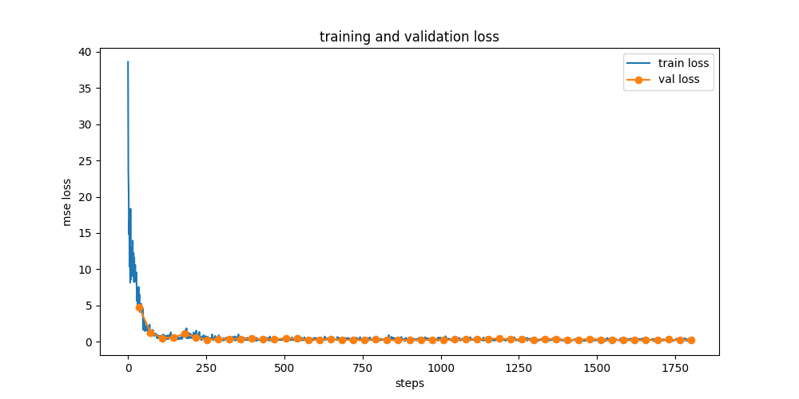

# MidiBERT Judge

Fine-tuning of MidiBERT (pre-trained transformer) for the automatic evaluation of MIDI musical sequences. The model predicts a score between 0 and 10 based on musical quality.

## Approach

Training by corruption: the dataset of MAESTRO sequences are corrupted in a controlled manner (pitch, rhythm, phrasing, expression) and a rating is assigned to each  depending on the severity of the corruption.
The model is then fine-tuned on this dataset to predict the score for each corrupted sequence.

## Diagnostic Results

Those results were obtained on a test set averaging on 10000 samples for each level of corruption.

| Severity | Expected Score | Prediction | Status |
|----------|---------------|------------|--------|
| 0% | 10.00 | 10.07 | OK |
| 25% | 5.00 | 5.78 | OK |
| 50% | 2.93 | 4.17 | OK - |
| 75% | 1.34 | 3.40 | not OK |
| 100% | 0.00 | 2.85 | not OK |

The model performs well on light and moderate corruptions but struggles with extremes (collapse zone at 75% and 100% levels). It has difficulty outputting very low scores, which might be explained by the fact that the original MidiBERT was trained on clean music (no negative examples). 

However, prediction is still decreasing as the corruption increases, which is a good sign.

## Training Curve

We can observe the loss decreases steadily over the training, indicating that the model is learning well. However, to reach a lower loss we might need to tackle the issue of low scores prediction.
